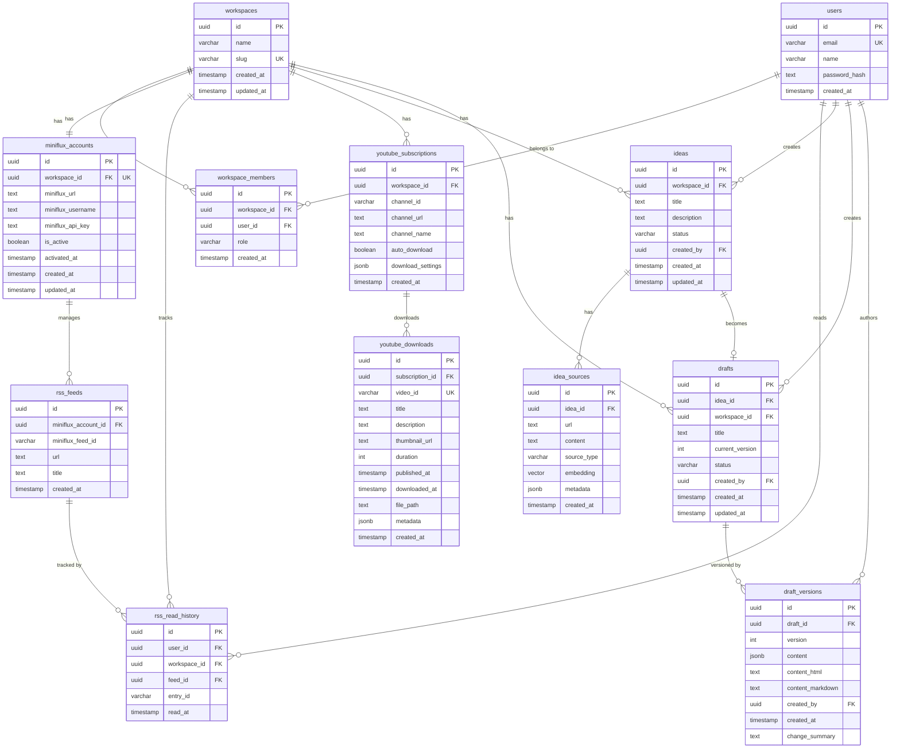

# Entity Relationship Diagram

## Overview

Fastwreck의 데이터베이스 스키마는 워크스페이스 기반의 멀티테넌시 구조로 설계되었습니다. 모든 주요 엔티티는 `workspace_id`를 통해 격리되며, PostgreSQL + pgvector를 사용하여 벡터 임베딩 기반 검색을 지원합니다.

## ER Diagram



## Table Specifications

### Core Tables

#### workspaces
워크스페이스는 모든 데이터의 최상위 격리 단위입니다.

| Column | Type | Constraints | Description |
|--------|------|-------------|-------------|
| id | UUID | PRIMARY KEY | 워크스페이스 고유 ID |
| name | VARCHAR(255) | NOT NULL | 워크스페이스 이름 |
| slug | VARCHAR(255) | UNIQUE | URL 친화적 식별자 |
| created_at | TIMESTAMP | DEFAULT NOW() | 생성 시각 |
| updated_at | TIMESTAMP | | 수정 시각 |

**Indexes:**
- PRIMARY KEY on `id`
- UNIQUE INDEX on `slug`

---

#### users
시스템 사용자 정보를 저장합니다.

| Column | Type | Constraints | Description |
|--------|------|-------------|-------------|
| id | UUID | PRIMARY KEY | 사용자 고유 ID |
| email | VARCHAR(255) | UNIQUE NOT NULL | 이메일 주소 |
| name | VARCHAR(255) | | 사용자 이름 |
| password_hash | TEXT | | 해시된 비밀번호 |
| created_at | TIMESTAMP | DEFAULT NOW() | 생성 시각 |

**Indexes:**
- PRIMARY KEY on `id`
- UNIQUE INDEX on `email`

---

#### workspace_members
워크스페이스와 사용자 간의 다대다 관계 및 권한을 관리합니다.

| Column | Type | Constraints | Description |
|--------|------|-------------|-------------|
| id | UUID | PRIMARY KEY | 멤버십 고유 ID |
| workspace_id | UUID | FK → workspaces(id) | 워크스페이스 참조 |
| user_id | UUID | FK → users(id) | 사용자 참조 |
| role | VARCHAR(50) | | 역할: 'owner', 'admin', 'member', 'viewer' |
| created_at | TIMESTAMP | DEFAULT NOW() | 생성 시각 |

**Constraints:**
- UNIQUE(workspace_id, user_id) - 한 워크스페이스에 중복 멤버십 방지

**Indexes:**
- PRIMARY KEY on `id`
- UNIQUE INDEX on `(workspace_id, user_id)`
- INDEX on `workspace_id`
- INDEX on `user_id`

---

### Discovery Tables

#### miniflux_accounts
워크스페이스별 Miniflux 계정 연동 정보를 저장합니다. 하나의 워크스페이스는 하나의 Miniflux 계정을 가지며, 팀원들이 이를 공유합니다.

| Column | Type | Constraints | Description |
|--------|------|-------------|-------------|
| id | UUID | PRIMARY KEY | Miniflux 계정 고유 ID |
| workspace_id | UUID | FK → workspaces(id), UNIQUE | 워크스페이스 참조 (1:1 관계) |
| miniflux_url | TEXT | | Miniflux 인스턴스 URL (기본: Docker Compose 내부) |
| miniflux_username | TEXT | | Miniflux 사용자명 |
| miniflux_api_key | TEXT | | Miniflux API 키 (암호화 저장 권장) |
| is_active | BOOLEAN | DEFAULT false | RSS 기능 활성화 여부 |
| activated_at | TIMESTAMP | | RSS 기능 활성화 시각 |
| created_at | TIMESTAMP | DEFAULT NOW() | 생성 시각 |
| updated_at | TIMESTAMP | | 수정 시각 |

**Constraints:**
- UNIQUE(workspace_id) - 워크스페이스당 하나의 Miniflux 계정만 허용

**Indexes:**
- PRIMARY KEY on `id`
- UNIQUE INDEX on `workspace_id`

**Security Notes:**
- `miniflux_api_key`는 반드시 암호화하여 저장 (AES-256 권장)
- API 키는 백엔드에서만 복호화하여 사용
- 프론트엔드에는 마스킹된 형태로만 노출

**Lifecycle:**
1. 워크스페이스 생성 시 `miniflux_accounts` 레코드도 함께 생성 (is_active=false)
2. 사용자가 RSS 기능 활성화 시:
   - Miniflux API를 통해 계정 생성
   - API 키 발급 및 암호화 저장
   - is_active=true, activated_at 설정

---

#### rss_feeds
RSS 피드 구독 정보를 저장합니다. Miniflux 계정을 통해 관리됩니다.

| Column | Type | Constraints | Description |
|--------|------|-------------|-------------|
| id | UUID | PRIMARY KEY | 피드 고유 ID |
| miniflux_account_id | UUID | FK → miniflux_accounts(id) | Miniflux 계정 참조 |
| miniflux_feed_id | VARCHAR(255) | | Miniflux 내부 피드 ID |
| url | TEXT | NOT NULL | RSS 피드 URL |
| title | TEXT | | 피드 제목 |
| created_at | TIMESTAMP | DEFAULT NOW() | 생성 시각 |

**Indexes:**
- PRIMARY KEY on `id`
- INDEX on `miniflux_account_id`
- INDEX on `miniflux_feed_id`

---

#### rss_read_history
사용자별 RSS 아이템 읽음 상태를 추적합니다.

| Column | Type | Constraints | Description |
|--------|------|-------------|-------------|
| id | UUID | PRIMARY KEY | 히스토리 고유 ID |
| user_id | UUID | FK → users(id) | 사용자 참조 |
| workspace_id | UUID | FK → workspaces(id) | 워크스페이스 참조 |
| feed_id | UUID | FK → rss_feeds(id) | 피드 참조 |
| entry_id | VARCHAR(255) | | Miniflux entry ID |
| read_at | TIMESTAMP | DEFAULT NOW() | 읽은 시각 |

**Constraints:**
- UNIQUE(user_id, entry_id) - 중복 읽기 기록 방지

**Indexes:**
- PRIMARY KEY on `id`
- UNIQUE INDEX on `(user_id, entry_id)`
- INDEX on `workspace_id`
- INDEX on `feed_id`

---

#### youtube_subscriptions
YouTube 채널 구독 정보를 저장합니다.

| Column | Type | Constraints | Description |
|--------|------|-------------|-------------|
| id | UUID | PRIMARY KEY | 구독 고유 ID |
| workspace_id | UUID | FK → workspaces(id) | 워크스페이스 참조 |
| channel_id | VARCHAR(255) | | YouTube 채널 ID |
| channel_url | TEXT | NOT NULL | 채널 URL |
| channel_name | TEXT | | 채널 이름 |
| auto_download | BOOLEAN | DEFAULT false | 자동 다운로드 여부 |
| download_settings | JSONB | | 다운로드 설정 {quality, format 등} |
| created_at | TIMESTAMP | DEFAULT NOW() | 생성 시각 |

**Indexes:**
- PRIMARY KEY on `id`
- INDEX on `workspace_id`
- INDEX on `channel_id`

---

#### youtube_downloads
다운로드된 YouTube 비디오 정보를 저장합니다.

| Column | Type | Constraints | Description |
|--------|------|-------------|-------------|
| id | UUID | PRIMARY KEY | 다운로드 고유 ID |
| subscription_id | UUID | FK → youtube_subscriptions(id) | 구독 참조 |
| video_id | VARCHAR(255) | UNIQUE | YouTube 비디오 ID |
| title | TEXT | | 비디오 제목 |
| description | TEXT | | 비디오 설명 |
| thumbnail_url | TEXT | | 썸네일 URL |
| duration | INT | | 비디오 길이 (초) |
| published_at | TIMESTAMP | | YouTube 발행 시각 |
| downloaded_at | TIMESTAMP | | 다운로드 시각 |
| file_path | TEXT | | 저장된 파일 경로 |
| metadata | JSONB | | 추가 메타데이터 |
| created_at | TIMESTAMP | DEFAULT NOW() | 생성 시각 |

**Indexes:**
- PRIMARY KEY on `id`
- UNIQUE INDEX on `video_id`
- INDEX on `subscription_id`

---

### Ideas Tables

#### ideas
Discovery에서 발견한 콘텐츠를 기반으로 생성된 아이디어를 저장합니다.

| Column | Type | Constraints | Description |
|--------|------|-------------|-------------|
| id | UUID | PRIMARY KEY | 아이디어 고유 ID |
| workspace_id | UUID | FK → workspaces(id) | 워크스페이스 참조 |
| title | TEXT | NOT NULL | 아이디어 제목 |
| description | TEXT | | 아이디어 설명 |
| status | VARCHAR(50) | DEFAULT 'new' | 상태: 'new', 'in_review', 'approved', 'drafted' |
| created_by | UUID | FK → users(id) | 생성자 참조 |
| created_at | TIMESTAMP | DEFAULT NOW() | 생성 시각 |
| updated_at | TIMESTAMP | | 수정 시각 |

**Indexes:**
- PRIMARY KEY on `id`
- INDEX on `workspace_id`
- INDEX on `created_by`
- INDEX on `status`

---

#### idea_sources
아이디어의 출처(RSS, YouTube 등)와 벡터 임베딩을 저장합니다.

| Column | Type | Constraints | Description |
|--------|------|-------------|-------------|
| id | UUID | PRIMARY KEY | 소스 고유 ID |
| idea_id | UUID | FK → ideas(id) | 아이디어 참조 |
| url | TEXT | | 소스 URL |
| content | TEXT | | 소스 콘텐츠 |
| source_type | VARCHAR(50) | | 타입: 'rss', 'youtube', 'manual' |
| embedding | VECTOR(1536) | | OpenAI ada-002 임베딩 |
| metadata | JSONB | | 메타데이터 {title, author, publishedAt 등} |
| created_at | TIMESTAMP | DEFAULT NOW() | 생성 시각 |

**Constraints:**
- Requires `pgvector` extension

**Indexes:**
- PRIMARY KEY on `id`
- INDEX on `idea_id`
- IVFFLAT INDEX on `embedding` using `vector_cosine_ops`

**PostgreSQL Setup:**
```sql
CREATE EXTENSION IF NOT EXISTS vector;
CREATE INDEX ON idea_sources USING ivfflat (embedding vector_cosine_ops);
```

---

### Drafts Tables

#### drafts
작성 중인 초안을 저장합니다.

| Column | Type | Constraints | Description |
|--------|------|-------------|-------------|
| id | UUID | PRIMARY KEY | 초안 고유 ID |
| idea_id | UUID | FK → ideas(id), NULLABLE | 연결된 아이디어 (선택적) |
| workspace_id | UUID | FK → workspaces(id) | 워크스페이스 참조 |
| title | TEXT | NOT NULL | 초안 제목 |
| current_version | INT | DEFAULT 1 | 현재 버전 번호 |
| status | VARCHAR(50) | DEFAULT 'draft' | 상태: 'draft', 'review', 'ready', 'published' |
| created_by | UUID | FK → users(id) | 생성자 참조 |
| created_at | TIMESTAMP | DEFAULT NOW() | 생성 시각 |
| updated_at | TIMESTAMP | | 수정 시각 |

**Indexes:**
- PRIMARY KEY on `id`
- INDEX on `workspace_id`
- INDEX on `idea_id`
- INDEX on `created_by`
- INDEX on `status`

---

#### draft_versions
초안의 버전 히스토리를 저장합니다.

| Column | Type | Constraints | Description |
|--------|------|-------------|-------------|
| id | UUID | PRIMARY KEY | 버전 고유 ID |
| draft_id | UUID | FK → drafts(id) | 초안 참조 |
| version | INT | NOT NULL | 버전 번호 |
| content | JSONB | | Tiptap JSON 포맷 |
| content_html | TEXT | | 렌더링된 HTML |
| content_markdown | TEXT | | Markdown 포맷 |
| created_by | UUID | FK → users(id) | 작성자 참조 |
| created_at | TIMESTAMP | DEFAULT NOW() | 생성 시각 |
| change_summary | TEXT | | 변경 사항 요약 |

**Constraints:**
- UNIQUE(draft_id, version) - 버전 중복 방지

**Indexes:**
- PRIMARY KEY on `id`
- UNIQUE INDEX on `(draft_id, version)`
- INDEX on `draft_id`

---

## Database Configuration

### Required PostgreSQL Extensions

```sql
-- Vector similarity search
CREATE EXTENSION IF NOT EXISTS vector;

-- UUID generation
CREATE EXTENSION IF NOT EXISTS "uuid-ossp";
```

### Performance Considerations

1. **Vector Index Settings**
   - IVFFlat 인덱스는 데이터가 일정량(~10,000 rows) 이상일 때 효과적
   - Lists parameter 조정으로 성능 최적화 가능

2. **JSONB Indexing**
   - 자주 쿼리되는 JSONB 필드에는 GIN 인덱스 추가
   - 예: `CREATE INDEX ON youtube_downloads USING GIN (metadata);`

3. **Partitioning**
   - Phase 2+에서 대용량 데이터 처리 시 파티셔닝 고려
   - `rss_read_history`, `draft_versions` 등이 후보

### Multi-tenancy Isolation

모든 워크스페이스 종속 테이블에서 Row-Level Security (RLS) 사용 권장:

```sql
-- Example for ideas table
ALTER TABLE ideas ENABLE ROW LEVEL SECURITY;

CREATE POLICY workspace_isolation ON ideas
    USING (workspace_id = current_setting('app.current_workspace_id')::uuid);
```

---

## Migration Strategy

### Phase 1 (MVP)
1. Core tables: `workspaces`, `users`, `workspace_members`
2. Discovery: `miniflux_accounts`, `rss_feeds`, `rss_read_history`, `youtube_subscriptions`, `youtube_downloads`
3. Ideas: `ideas`, `idea_sources` (with pgvector)
4. Drafts: `drafts`, `draft_versions`

### Phase 2+ (Future)
- `channels` - 발행 채널 정보
- `style_books` - 라이팅 가이드
- `publish_history` - 발행 이력
- `webhooks` - Webhook 설정
- `analytics` - 성과 분석 데이터

---

## Notes

- 모든 Primary Key는 UUID 사용 (보안 및 분산 시스템 고려)
- TIMESTAMP는 UTC 기준으로 저장
- JSONB는 유연한 메타데이터 저장에 사용
- Vector embeddings는 OpenAI ada-002 모델 기준 (1536 dimensions)
- 외래키는 모두 `ON DELETE CASCADE` 또는 `ON DELETE SET NULL` 설정 필요
